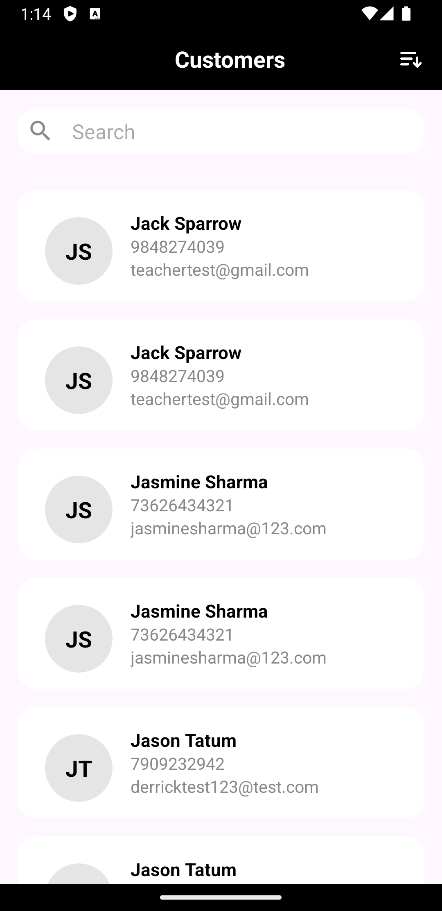

# Android Project: TestApp

## Description:
This Android project demonstrates how to implement API calling using Retrofit, display data in a RecyclerView, add search functionality by name and number, implement pagination, and sorting.

## Features:
- **API Calling:** Utilizes Retrofit library for making API calls to retrieve data.
- **RecyclerView:** Displays the data in a scrollable list using RecyclerView.
- **Search Functionality:** Enables users to search for items by name and number.
- **Pagination:** Implements pagination to load data in chunks for better performance.
- **Sorting:** Allows sorting of items based on specific criteria.

## Requirements:
- Android Studio (version 4.0+)
- Minimum SDK version: Android 7.0 (API level 24)
- Internet permission in AndroidManifest.xml

## Installation:
1. Clone this repository to your local machine using the following command:

2. Open the project in Android Studio.
3. Build and run the project on your Android device or emulator.

## Usage:
1. Launch the application on your device or emulator.
2. Explore the data displayed in the RecyclerView.
3. Use the search functionality to find specific items by name or number.
4. Pagination will automatically load more data as you scroll.
5. Sorting can be applied to reorder the items based on your preference.

## API Documentation:
- **API Endpoint:** `https://cgv2.creativegalileo.com/api/V1/customer/filter`
- **Request Method:** GET
- **Parameters:**
- `name`: Filter by customer name (optional)
- `mobile`: Filter by customer mobile number (optional)
- `paginated`: Enable pagination (required, set to `true`)
- `pageNo`: Page number for pagination (required)
- `pageSize`: Number of items per page (required)

## Dependencies:
- Retrofit: [2.9.0]
- RecyclerView: [1.3.2]

## ScreenShots:

